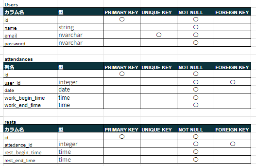
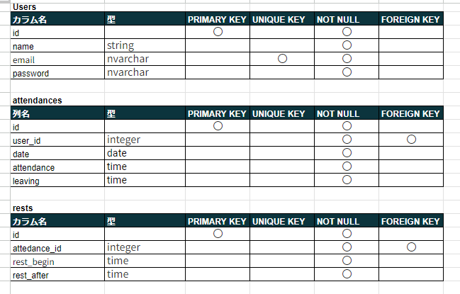

# アプリケーション名
Atte（勤怠管理システム）

## 作成した目的
毎日の労働時間管理

## アプリケーションURL

## 他のリポジトリ

## 機能一覧
- 会員登録
- ログイン
- ログアウト
- ログイン認証（メール認証）
- 勤務開始、休憩開始、休憩終了、勤務終了時刻打刻
- 日付別勤怠情報検索機能
- ユーザーページ
- ページネーション

## 使用技術（実行環境）
- Laravel8.x
- php:7.4.9
- nginx:1.21.1
- mysql:8.0.26

## テーブル設計

## ER図

## 環境構築

## その他（詳細情報）

