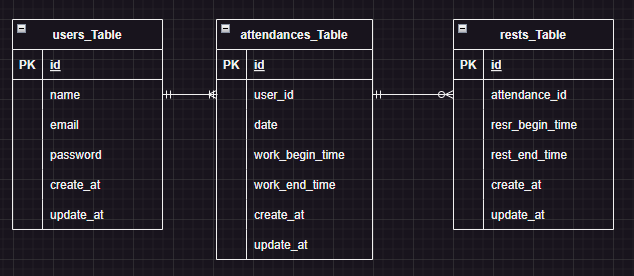
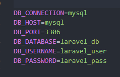

# アプリケーション名
Atte（勤怠管理システム）

## 作成した目的
毎日の労働時間管理

## アプリケーションURL
・開発環境:http://localhost/
・phpMyAdmin:：http://localhost:8080/
※新規のユーザー登録をお願いいたします。

## 他のリポジトリ

## 機能一覧
- 会員登録
- ログイン
- ログアウト
- ログイン認証（メール認証）
- 勤務開始、休憩開始、休憩終了、勤務終了時刻打刻
- 日付別勤怠情報検索機能
- ユーザーページ
- ページネーション

## 使用技術（実行環境）
- Laravel8.x
- php:7.4.9
- nginx:1.21.1
- mysql:8.0.26

## テーブル設計

## ER図

## 環境構築
### Dockerビルド
1.git clone git@github.com:kanai-naoki/beginner_mission.git
2.DockerDesktopアプリを立ち上げる
3.docker-compose up -d --build

### Laravel環境構築
1.docker-compose exec php bash
2.composer-install
3.「.env.example」ファイルをコピーして「.env」ファイルに名前を変更
4.「.env」に以下の環境変数を追加

5.アプリケーションキーの追加 php artisan key:generate
6.マイグレーション実行　php artisan migrate
## その他（詳細情報「）

